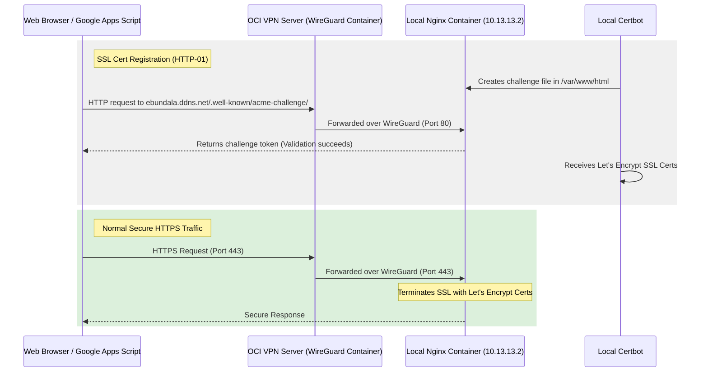

# Implementation Plan - Multiple Port Forwarding (80/443) and Let's Encrypt SSL

This plan outlines the steps to configure port forwarding for both HTTP (port 80) and HTTPS (port 443) from the OCI VPN server to the local development machine. This enables you to request and use a real Let's Encrypt SSL certificate locally for your No-IP subdomains (`ebundala.ddns.net`, `mechsoft.ddns.net`, and `shopcare.ddns.net`).

## Proposed Architecture



---

## Proposed Changes

### 1. OCI WireGuard Configuration

We will update the OCI WireGuard container config to map and forward both port 80 and port 443.

#### [MODIFY] [docker-compose.yml](file:///home/ebundala/projects/wireguard_docker/docker-compose.yml)
- Update `ports` to expose both `80:80` and `443:443`.
- Update the environment section to accept a comma-separated list of port mappings: `FORWARD_PORTS=80:80,443:443`.

#### [MODIFY] [forward-ports.sh](file:///home/ebundala/projects/wireguard_docker/vpn-data/custom-cont-init.d/forward-ports.sh)
- Update the script to parse a comma-separated list of port mappings (e.g. `80:80,443:443`) and apply `iptables` rules for each mapping.

#### [MODIFY] [dist.env](file:///home/ebundala/projects/wireguard_docker/dist.env)
- Remove `PUBLIC_PORT` and `DEV_PORT` and replace with `FORWARD_PORTS=80:80,443:443`.

---

### 2. Local Nginx & SSL Configuration (ShopCare)

We will configure Nginx to expose port 443 and mount the Let's Encrypt certificates.

#### [MODIFY] [docker-compose.yaml](file:///home/ebundala/projects/shopcare/db/docker-compose.yaml)
- Map local ports `80:80` and `443:443` to the `webserver` service.
- Mount `/etc/letsencrypt` folder from host or named volume to the `webserver` service to share the generated certificates.

#### [MODIFY] [local.conf](file:///home/ebundala/projects/shopcare/db/webserver/nginx-conf/local.conf)
- Create new server blocks for `ebundala.ddns.net`, `mechsoft.ddns.net`, and `shopcare.ddns.net` on port `443 ssl`.
- Reference the Let's Encrypt certificates path `/etc/letsencrypt/live/ebundala.ddns.net/fullchain.pem` and `privkey.pem`.

---

## Verification & Execution Plan

### Step 1: Apply OCI VPN Changes
1. Push the updated WireGuard configuration to the OCI host.
2. Edit `.env` on OCI:
   ```env
   FORWARD_PORTS=80:80,443:443
   PEER_IP=10.13.13.2
   ```
3. Restart the OCI WireGuard container: `sudo docker compose down && sudo docker compose up -d`.

### Step 2: Request Let's Encrypt Certificate Locally
Since port 80 is forwarded to your local machine, run Certbot locally using Docker:
```bash
docker run -it --rm --name certbot \
  -v "/home/ebundala/projects/shopcare/db/webserver/certbot/certbot-etc:/etc/letsencrypt" \
  -v "/home/ebundala/projects/shopcare/db/webserver/certbot/certbot-var:/var/lib/letsencrypt" \
  -v "/home/ebundala/projects/shopcare/db/webserver/web-root:/var/www/html" \
  certbot/certbot certonly --webroot --webroot-path=/var/www/html \
  -d ebundala.ddns.net -d mechsoft.ddns.net -d shopcare.ddns.net \
  --email your-email@example.com --agree-tos --no-eff-email
```

### Step 3: Mount Certs and Start Nginx
1. Update `docker-compose.yaml` (local) to mount the generated certs folder into the `webserver` container.
2. Update Nginx `local.conf` to use the new certificates.
3. Restart Nginx locally: `docker compose up -d --force-recreate webserver`.
